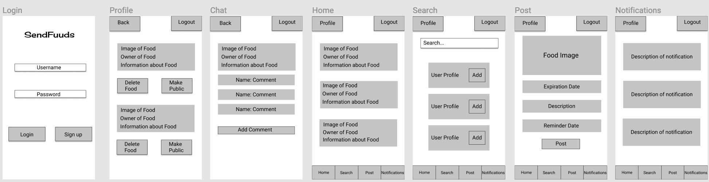
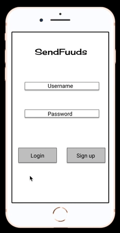
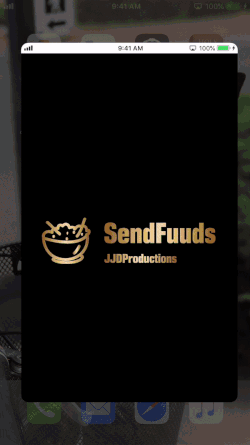
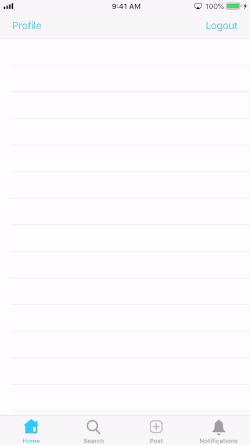
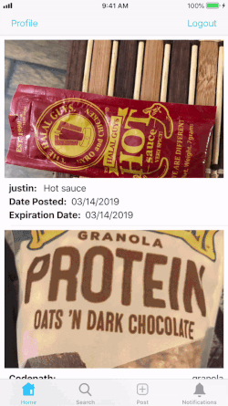
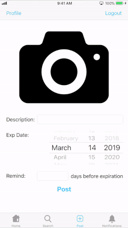
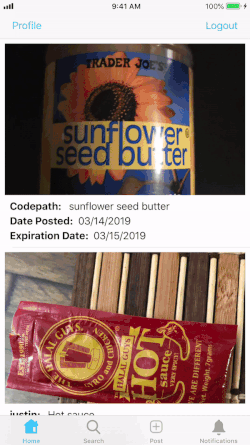

# SendFuuds

## Table of Contents
1. [Overview](#Overview)
1. [Product Specification](#Product-Specification)
1. [Wireframes](#Wireframes)
1. [Schema](#Schema)
1. [Walkthrough](#Walkthrough)
1. [App Pitch Presentation](#App-Pitch-Presentation)
1. [Authors](#Authors)

## Overview

### App Description
Have you ever forgotten about a food you bought, and just ended up throwing it away because it expired? Chances are, you have. 

**JJDProductions** aims to solve this huge problem in the world today with **SendFuuds**.

**SendFuuds** is an application where users can get notified that their food is about to expire and are given an option to share it with friends.

Uses [Parse](https://docs.parseplatform.org/parse-server/guide/) for storing data. 

### App Evaluation
- **Category:** Social Media/Personal use
- **Mobile:** This app would be primarily developed for iOS users and will work similar to apps like [Instagram](https://www.instagram.com/?hl=en).
- **Story:** A user takes a picture of their food, enters the expiration date and a general description, and posts it to their personal list. Days pass and the user gets notified that their food is about to expire, so they need to take action. The user then shares the food publicly to their friends. A friend comments on the user's post, letting the user know that they are interested in their food. The user and the friend discuss and finalize a time and place to meet. Once the friend has gotten the user's food, the user deletes the post. 
- **Market:** Any individual could choose to use this app. We all need to be aware of the food that we waste each day!
- **Habit:** This app could be used more often by people who cook to ensure that the groceries they buy do not expire. 
- **Scope:** We will start by having users around UC Irvine use the application, but we expect that this application can be used by people around the world.

## Product-Specification

### User Stories

**Required Must-have Stories**
- [x] User can log in
- [x] User can sign up
- [x] User stays logged in across restarts.
- [x] User can log out.
- [x] User must enter correct login/sign up credentials
- [x] User can enter the expiration date and description of their food and post it to their personal list of foods.
- [x] User can remove their own posts from their personal list
- [x] User can post an image from either their photo gallery or camera. 
- [x] User can share their post publicly to the home feed.
- [x] User can search and add friends.
- [x] User can only see their own posts and their friends' posts on the home feed.
- [x] User can comment on other user's posts. 
- [x] User gets notified when their food is about to expire.

**Optional Nice-to-have Stories**
- [x] When a User comments on a post, the creator of the post gets a push notification when the app is in the background.
- [ ] When a User comments on a post, the creator of the post gets a push notification even if the app is terminated.
- [ ] Users have a fully functional profile page, as opposed to just a personal list of food. 
- [ ] To add a friend, a User should send a friend request to another User, and the other User has to accept that request in order for the two Users to be friends. 
- [ ] User can remove friends. 
- [ ] Once a food is expired, the food should be deleted from the User's personal list and home feed.
- [ ] User can privately message other users
- [ ] User can see mutual friends.
- [ ] User can search for specific food in their feed.
- [ ] User can link other social media platforms (Instagram, Facebook, Twitter, etc.)

### App Screen Archetypes

 * Login Screen
     * User can login
     * User can create a new account
 * Stream (Home Screen)
     * User can view a feed of their own food and their friends' food.
 * Creation (Post Screen)
     * User can post a new food to their feed, add the expiration date, and a brief description.
 * Search Screen
     * User can search for other users
     * User can add another user
 * Notification Screen
     * User can see recent notifications that they have received.
 * Profile Screen
     * User can see their own posts.
     * Future feature - User has profile image, description, and more information.
 * Comment Screen
     * User can comment on their friend's public post

### App Navigation Flows

**Tab Navigation**

 * Home Feed
 * Search User
 * Post a Food
 * Notification 

**Flow Navigation**

 * Login Screen
    * Home after logging in or signing up.
 * Stream (Home Screen)
    * Login Screen by clicking the Logout button.
    * Future version might involve navigation to a profile page for a user.
    * Any other screen by clicking one of them on the tab bar.
    * Login screen by clicking logout.
    * Comment screen by clicking on a specific post.
 * Creation (Post Screen)
    * Home after a user posts their food.
    * Any other screen by clicking one of them on the tab bar.
    * Login screen by clicking logout.
 * Search Screen.
    * Any other screen by clicking one of them on the tab bar.
    * Login screen by clicking logout.
 * Notification Screen
    * Any other screen by clicking one of them on the tab bar.
    * Login screen by clicking logout.
 * Comment Screen
    * Home by clicking the back button.
    * Login screen by clicking logout.
    
## Wireframes

### Digital Mockup

### Interactive Prototype

### Source
https://www.figma.com/proto/BNQyBUMhIxUdroJeTUbXtPLb/SendFuuds?node-id=0%3A1&scaling=scale-down

## Schema 
### Models

#### User

   | Property      | Type     | Description |
   | ------------- | -------- | ------------|
   | username      | String   | user's unique username |
   | password        | String | user's password | 
   | createdAt | Date | Date that the object was created |
   | updatedAt | Date | Date that the object has been updated |
   
#### userInfo

   | Property      | Type     | Description |
   | ------------- | -------- | ------------|
   | username      | String   | user's unique username |
   | friends        | array of String | array of user's friends| 
   | createdAt | Date | Date that the object was created |
   | updatedAt | Date | Date that the object has been updated |
   
#### Foods

   | Property      | Type     | Description |
   | ------------- | -------- | ------------|
   | owner      | String   | user's unique username |
   | image        | image file (any is taken) | user's image of their food |
   | description | String | description of user's food |
   | date | Date | the expiration date of the food | 
   | notifyDay | Date | the date that user will get notified |
   | createdAt | Date | Date that the object was created |
   | updatedAt | Date | Date that the object has been updated |
   | comments        | array of Comments objects | all comments on the food post|
   | numComments | Integer | Number of comments in the comments array |
   
#### Comments

   | Property      | Type     | Description |
   | ------------- | -------- | ------------|
   | author      | String   | user's unique username |
   | food        | Food object | pointer to the food object that this comment refers to |
   | text      | String   | the comment's text |
   | createdAt | Date | Date that the object was created |
   | updatedAt | Date | Date that the object has been updated |
   
#### Notifications

   | Property      | Type     | Description |
   | ------------- | -------- | ------------|
   | username      | String   | user's unique username |
   | text      | String   | the notification's text |
   | image        | image file (any is taken) | user's image of their food |
   | food        | Food object | pointer to the food object that this notification refers to |
   | day      | Date   | Date that user will be notified |
   | createdAt | Date | Date that the object was created |
   | updatedAt | Date | Date that the object has been updated |
  

## Walkthrough

### Signing up/logging in
**Walkthrough of the following user stories:**
- [x] User can log in
- [x] User can sign up
- [x] User stays logged in across restarts.
- [x] User can log out.

### Checking credentials
**Walkthrough of the following user stories:**
- [x] User must enter correct login/sign up credentials

### Posting and removing posts
**Walkthrough of the following user stories:**
- [x] User can enter the expiration date and description of their food and post it to their personal list of foods.
- [x] User can remove their own posts from their personal list
- [x] User can post an image from either their photo gallery or camera. 

### Adding friends and sharing posts with friends
**Walkthrough of the following user stories:**
- [x] User can share their post publicly to the home feed.
- [x] User can search and add friends.
- [x] User can only see their own posts and their friends' posts on the home feed.

### Commenting on posts
**Walkthrough of the following user stories:**
- [x] User can comment on other user's posts. 

### Notification of food expiration
**Walkthrough of the following user stories:**
- [x] User gets notified when their food is about to expire.

### Comment Notification
**Walkthrough of the following user stories:**
- [x] When a User comments on a post, the creator of the post gets a push notification when the app is in the background.

### Walkthrough of our first prototype
**Walkthrough of the following user stories:**

- [x] User can log in
- [x] User can sign up
- [x] User stays logged in across restarts.
- [x] User can log out.
- [x] User must enter correct login/sign up credentials
- [x] User can enter the expiration date of their groceries and post it to a home feed.
- [x] User has the option to post an image from their photo gallery or camera. 
- [x] User can search and add friends.
- [x] User can only see his own posts and his friends' posts on the home feed.
- [x] User gets notified when their food is about to expire.

## App-Pitch-Presentation

Link to slideshow: https://docs.google.com/presentation/d/1Pi85jbgGdUlxdtAM7uu35Dkz8yFu3WYfm1H8trJfX3g/edit?usp=sharing

## Authors

SendFuuds implemented by **JJDProductions:**

* **Joshua Tavassolikhah** - [JoshTavasso](https://github.com/JoshTavasso)

* **Justin Leong** - [justinleong360](https://github.com/justinleong360)

* **David Yip** - [davidyip50](https://github.com/davidyip50)

### Process of building this application

All authors collaborated together on 1 laptop at a time. Work was always done together and all features were implemented as a team. 

 
